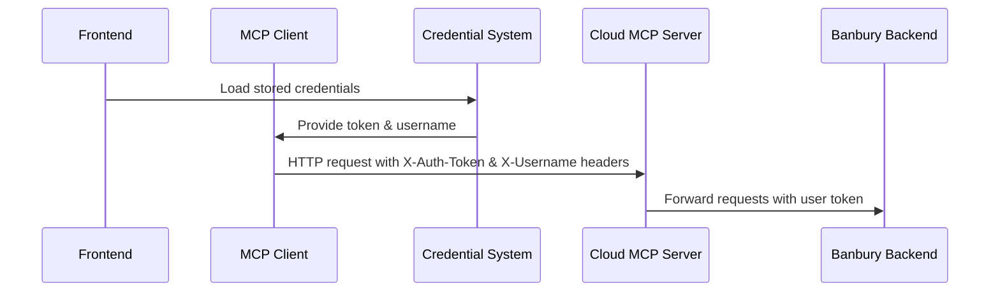
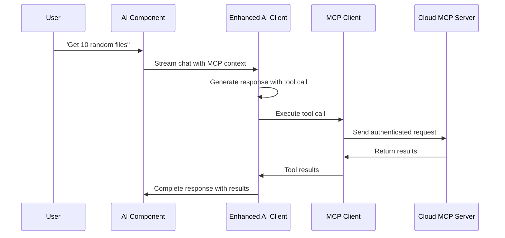

# Banbury Frontend MCP Integration Guide

## Overview

The Banbury frontend now includes comprehensive integration with the Banbury MCP (Model Context Protocol) Server, enabling large language models to interact with Banbury's backend services directly through natural language conversations.

## New Components

### 1. CloudMcpClient (`packages/core/src/mcp/CloudMcpClient.ts`)

A TypeScript client that communicates with the cloud-deployed Banbury MCP server:

- **Authentication**: Automatically uses credentials from the existing Banbury auth system
- **Tool Calling**: Supports all MCP tools (file management, device info, tasks, etc.)
- **Error Handling**: Comprehensive error management and user feedback
- **Convenience Methods**: Pre-built functions for common operations

### 2. useMcpClient Hook (`packages/frontend/src/hooks/useMcpClient.tsx`)

A React hook that provides MCP functionality to components:

- **State Management**: Tracks connection, authentication, and error states
- **Auto-Connection**: Automatically connects when credentials are available
- **Tool Parsing**: Parses natural language requests into tool calls
- **React Integration**: Seamlessly integrates with React component lifecycle

### 3. EnhancedAIClient (`packages/core/src/ai/EnhancedAIClient.ts`)

An enhanced AI client that combines Ollama with MCP tool calling:

- **Dual Mode**: Works with or without MCP tools enabled
- **System Prompts**: Automatically includes tool documentation for LLMs
- **Tool Execution**: Detects and executes tool calls from AI responses
- **Streaming**: Supports real-time streaming with tool execution

### 4. Enhanced AI Component (`packages/frontend/src/components/pages/AI/AI.tsx`)

The updated AI interface with MCP integration:

- **MCP Controls**: Toggle MCP tools on/off, view connection status
- **Quick Actions**: One-click buttons for common MCP operations
- **Status Display**: Real-time MCP connection and authentication status
- **Seamless Integration**: Tool results appear naturally in conversation

## How It Works

### 1. Authentication Flow



The `CloudMcpClient` automatically includes the following headers in requests to the MCP server:

- **Authorization**: `Bearer <token>` - The user's Banbury authentication token (follows axios global headers pattern)
- **X-Username**: The user's Banbury username  
- **X-API-Key**: The MCP server's API key (if configured)

This eliminates the need to manually pass tokens in request parameters and follows the same authentication pattern used throughout the Banbury frontend.

### 2. Tool Calling Process



## Usage Examples

### 1. Basic MCP Tool Usage

Users can interact with Banbury tools using natural language:

```
User: "Get 10 random files from my system"
AI: I'll get 10 random files for you from your Banbury-scanned directories.

```mcp-tool
{
  "tool": "banbury-get-scanned-folders",
  "parameters": {
    "environment": "dev"
  }
}
```

[Tool executes...]

Based on your scanned folders, here are 10 random files:
[Results displayed in a readable format]
```

### 2. Task Management

```
User: "Add a task to process my recent documents"
AI: I'll create a task for you in the Banbury system.

```mcp-tool
{
  "tool": "banbury-add-task",
  "parameters": {
    "task_description": "Process recent documents",
    "environment": "dev"
  }
}
```

✅ Task "Process recent documents" has been successfully added to your Banbury system.
```

### 3. Device Information

```
User: "What's the status of my device?"
AI: Let me check your device information.

```mcp-tool
{
  "tool": "banbury-get-device-info",
  "parameters": {
    "device_name": "your-device-name",
    "environment": "dev"
  }
}
```

Here's your current device status:
[Device information displayed]
```

## Configuration

### Environment Variables

Add these to your `.env` file:

```bash
# MCP Server Configuration
REACT_APP_MCP_SERVER_URL=https://your-cloud-mcp-server.com
REACT_APP_MCP_API_KEY=your-mcp-api-key

# Banbury Backend (already configured)
REACT_APP_BANBURY_DEV_URL=http://www.api.dev.banbury.io
REACT_APP_BANBURY_PROD_URL=http://54.224.116.254:8080
```

### Component Usage

To use MCP functionality in a React component:

```typescript
import { useMcpClient } from '../../../hooks/useMcpClient';

function MyComponent() {
  const {
    client,
    isConnected,
    isAuthenticated,
    callTool,
    getRandomFiles,
    addTask
  } = useMcpClient();

  const handleGetFiles = async () => {
    const result = await getRandomFiles(5);
    if (result.success) {
      console.log('Files:', result.content);
    }
  };

  return (
    <div>
      <p>MCP Status: {isAuthenticated ? 'Ready' : 'Not authenticated'}</p>
      <button onClick={handleGetFiles}>Get Random Files</button>
    </div>
  );
}
```

## Available MCP Tools

### Authentication
- `banbury-login`: Authenticate with username/password

### Device Management
- `banbury-get-device-info`: Get information about a specific device
- `banbury-update-device`: Update device information
- `banbury-declare-online`: Declare a device as online

### File Management
- `banbury-get-files`: Get files from a specific path
- `banbury-get-scanned-folders`: Get list of scanned folders

### Task Management
- `banbury-get-sessions`: Get current sessions
- `banbury-add-task`: Add a new task

### Model Management
- `banbury-add-model`: Add a downloaded model to a device

### Utility Tools
- `add`: Simple addition (for testing)
- `get-joke`: Get a random joke (for entertainment)

## UI Controls

### MCP Status Bar

The AI interface includes a status bar showing:

- **MCP Tools Toggle**: Enable/disable MCP functionality
- **Connection Status**: Shows if MCP server is reachable
- **Authentication Status**: Shows if user is authenticated with Banbury
- **Available Tools Count**: Number of tools accessible
- **Quick Action Buttons**: One-click access to common operations

### Quick Actions

- **Get Random Files**: Instantly retrieve 10 random files
- **Add Sample Task**: Add a sample task to demonstrate functionality

## Error Handling

The system provides comprehensive error handling:

### Authentication Errors
- Automatically prompts for login when authentication expires
- Clear error messages for invalid credentials
- Graceful fallback to non-MCP mode when authentication fails

### Connection Errors
- Retry logic for transient network issues
- User-friendly error messages
- Offline mode support (falls back to regular Ollama)

### Tool Execution Errors
- Detailed error messages for failed tool calls
- Graceful degradation when tools are unavailable
- User feedback for all error conditions

## Troubleshooting

### Common Issues

1. **MCP Tools Not Working**
   - Check authentication status in the UI
   - Verify MCP server URL in environment variables
   - Ensure Banbury credentials are valid

2. **Tool Calls Not Executing**
   - Verify MCP tools are enabled (toggle in UI)
   - Check browser console for error messages
   - Ensure proper formatting of tool calls

3. **Authentication Failures**
   - Check if Banbury credentials are stored correctly
   - Verify token hasn't expired
   - Try logging out and back in

### Debug Mode

Enable debug logging by adding to your console:

```javascript
localStorage.setItem('banbury-mcp-debug', 'true');
```

This will log all MCP requests and responses for troubleshooting.

## Development

### Adding New Tools

To add a new MCP tool:

1. **Update the MCP Server** (in `banbury-mcp-server` project):
   ```typescript
   server.tool("my-new-tool", {
     token: z.string(),
     my_param: z.string(),
     environment: z.enum(['dev', 'prod']).default('dev')
   }, async ({ token, my_param, environment }) => {
     // Tool implementation
   });
   ```

2. **Update CloudMcpClient**:
   ```typescript
   public getAvailableTools(): string[] {
     return [
       // ... existing tools
       'my-new-tool'
     ];
   }
   ```

3. **Add convenience method** (optional):
   ```typescript
   public async myNewTool(param: string): Promise<McpToolResult> {
     return this.callTool({
       tool: 'my-new-tool',
       parameters: { my_param: param, environment: 'dev' }
     });
   }
   ```

### Testing

Run the test suite:

```bash
# Test MCP client
npm test -- --testPathPattern=mcp

# Test AI integration
npm test -- --testPathPattern=ai

# Test hooks
npm test -- --testPathPattern=hooks
```

## Security Considerations

- All MCP communications use HTTPS in production
- User tokens are never logged or exposed
- MCP server validates all requests against Banbury backend
- Frontend implements proper token refresh mechanisms
- No sensitive data is cached in browser storage

## Performance

- MCP tools are lazy-loaded for better performance
- Connection pooling reduces latency
- Streaming responses provide immediate feedback
- Background authentication refresh prevents interruptions
- Efficient caching of non-sensitive data

This integration provides a powerful bridge between conversational AI and the Banbury ecosystem, enabling users to interact with their data and services through natural language while maintaining full security and authentication. 